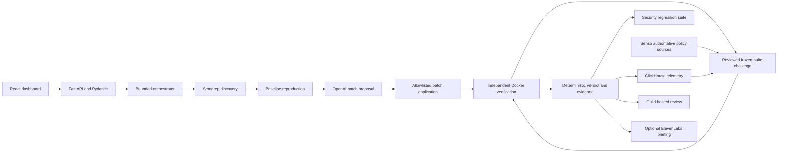

# Architecture

The core LedgerLite loop is implemented on `feat/security-engine`. Optional sponsor stages remain deferred; actual acceptance evidence is in `INTEGRATION.md`.

## Execution sequence

1. Accept only an allowlisted target id backed by an authorized local demo target. Pin original source, trusted policies, scanner rules, suite versions, and hashes.
2. Run actual Semgrep against the authorized immutable source; normalize findings without claiming successful reproduction.
3. Reproduce each selected finding against an isolated baseline and save redacted requests/responses, exit codes, logs, and test manifests. Failure to reproduce is explicit and cannot become a passing remediation claim.
4. Request a defensive patch proposal using source, finding, and previous deterministic feedback. Validate its structure and path allowlist before use.
5. Create a disposable source copy and apply the patch. Reject symlinks/path traversal, disallowed files, oversized diffs, and attempts to alter trusted verifier/policy/test inputs.
6. Scan patched source, then run frozen security and functional suites in Docker with isolation and bounded resources. Record all required tests, not only favorable outcomes.
7. Admit one reviewed frozen-suite challenge using a pinned local policy, then rerun baseline and patched tests in fresh containers. Optional Senso/ClickHouse/Akash selection is deferred; provider output can never define the trusted suite or verdict.
8. Execute challenges independently. Any failing required check rejects the current patch; missing/skipped/timeout evidence is inconclusive. Retry within a fixed budget, preserving every attempt.
9. Independent verifier emits a final verdict bound to target, patch, policy, suite, and artifact hashes. `verified` covers the executed suite only. Save admissible attacks as regression tests through a trusted review path; generated proposals cannot edit frozen tests during the run.
10. Produce reports; send redacted evidence to a real hosted Guild reviewer. Optional narration is derived from actual completed run evidence. These steps cannot replace deterministic verdicts.

## Modules and handoffs

`backend/api/` owns wire models and routes; `engine/` owns orchestration/scanning/patching/verifying; `providers/` defines typed external contracts; `storage/` persists local run manifests and hash-bound artifacts; `telemetry/` and `reports/` are B's adapters. Frontend imports generated API interfaces and does not access provider secrets. Cross-owner imports into `providers/contracts.py` require coordinated changes.

Each event has one canonical schema. Consumers preserve id, UTC timestamp, source, and lifecycle stage. Fixture telemetry stays separate. Evidence is local and redacted by default; remote destinations require deliberate approval and product-specific access configuration.

The core uses a local reviewed policy and fresh frozen-suite challenges. AkashML/Senso/ClickHouse/Guild/narration paths in the roadmap are not part of core composition. No database server is required. JSON schemas validate structure; they do not prove execution or security.
